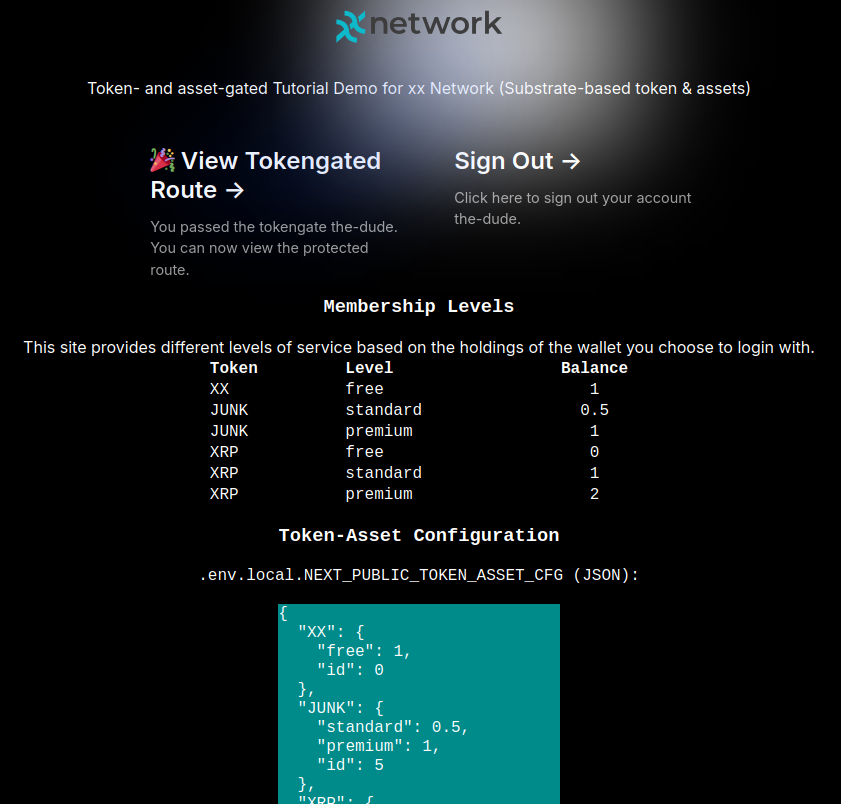

- [What is it](#what-is-it)
- [Requirements](#requirements)
- [What it does](#what-it-does)
- [How to run it](#how-to-run-it)
- [Use cases](#use-cases)
- [What was modified](#what-was-modified)
- [Config file and console log](#config-file-and-console-log)
  - [Token and asset configuration in .env.local](#token-and-asset-configuration-in-envlocal)
- [Console log](#console-log)
- [Issues, limitations, workarounds](#issues-limitations-workarounds)
  - [Address format](#address-format)
  - [Asset-gating](#asset-gating)
  - [Missing NEXT\_PUBLIC\_TOKEN\_ASSET\_CFG](#missing-next_public_token_asset_cfg)
- [License](#license)
- [Credits](#credits)

## What is it

This code demonstrates "token-gating" and "asset-gating" on xx Network (and possibly other compatible Substrate-based chains):

- "token-gating" is really "currency-gating" for the native currency of xx chain, XX (coin)
- "asset-gating" is really "token-gating" with xx chain-based assets (which should probably be called tokens, but they aren't since that's taken)

It works with static (server-rendered) and dynamic Web pages.

## Requirements

- Client-side: Polkadot{.js} Web3 wallet; other Web3 wallets may work
- Server-side: NodeJS with access to local or public xx chain RPC endpoint (ws[s]://)

## What it does

It can limit access to app/site or its sections (routes) based on ownership or balance of:

- XX coin, for example more than 0 or more than 100
- xx Chain asset(s), for example more than 1 QTY of asset ID 5
- any combination of two or more of these criteria

Screenshot of XX coin-gating: 


You may find more on asset-gating on xx chain [here](https://armchairancap.github.io/blog/2023/11/05/xx-network-asset-gated-access).

With xx asset-gated code added more recently (QTY 1 of asset ID 5- see further below for more on this):


## How to run it

Install Polkadot{.js} extension, create xx Network wallet, fund it with some amount of XX coin (1.01 XX, for example) and set it to work on `xx Network`.


Download this repo, create `.env.local` in root directory, and run:

```sh
cp .env.local.example .env.local
vim .env.local
npm run dev
```

My .env.local for non-production use:

```raw
NEXTAUTH_SECRET=123123123
NEXTAUTH_URL=http://localhost:3000
RPC_ENDPOINT=ws://192.168.1.30:63007
NEXT_PUBLIC_TOKEN_ASSET_CFG={"XX":{"free":1,"id":0},"JUNK":{"standard":0.5,"premium":1,"id":5},"XRP":{"free":0,"standard":1,"premium":2,"id":7}}
```

Go to http://localhost:3000 in the browser in which you installed Polkadot{.js} and connect the extension to http://localhost:3000, generate an address and make it restricted for use on xx Network (I hoped this would ensure balance will be looked up correctly, but it was not).

With that, I can login (see [xx_screenshot.png](./xx_screenshot.png)) and the balance of XX coin is correctly shown (since v1.1). 

**NOTES:** 

- you may fail to login without > 1.0 XX in your wallet. You may modify code to check for less or validate an asset balance instead
- regarding Polkadot{.js}, if you go to https://wallet.xx.network, Polkadot{.js} lets you add the wallet from the browser extension and show it in xx Network Wallet. Neat!
- `NEXT_PUBLIC_TOKEN_ASSET_CFG` doesn't play a role in checks (see below), but is required because `NEXT_PUBLIC_TOKEN_ASSET_CFG` is displayed on the home page (both table & JSON) and may be used in other pages. More on this later.



## Use cases

Obviously, token- and asset-gating of Web sites. But, in the context of xx Network, what kinds?

- Generic infrastructure services for validators - many of whom are too cheap to pay for anything, and too lazy or privacy-conscious to register
- Access to xx Network-related services such as Haven Space directory

Because token-gating only works for *checking* the free balance, site owner can't "deduct" any money from user's wallet. 

That may seem useless - at least with "NFT token-gating" they could have something to sell (NFT for site/service access), but what I think people sometimes miss is the fact that:

- site owner can get paid "out of band"
- site owner can check if the address has transferred xx coin to the site this month 
- site owner can pre-populate form fields with wallet/address used to log in, and provide service to addresses that have already paid

So this integration is not entirely useless even for sites that can't sell xx coin to their members.

## What was modified

- `pages/api/auth/[...nextauth].js`: modified for (XX) token and where "asset"-gating was added.

Currently, in the same file, we check for > 1 XX or more than 1 JUNK, but you can modify as you see fit:

`(accountInfo.data.free.gt(new BN(1_000_000_000)) || assetBalance >= 1)`

- `components/login.tsx`: added some functions for debugging, and logging to console, as you can see above.

- `pages/protected-api.tsx` and `pages/protected.tsx` ("static" protected page): changed the token unit to XX from KSM, changed the number of decimals to 9 from 12:
```sh
const ksmBalance = formatBalance( session.freeBalance, { decimals: 9, withSi: true, withUnit: 'XX' } )
```

- `pages/index.tsx`: layout modified for xx Network, `NEXT_PUBLIC_TOKEN_ASSET_CFG` is loaded and displayed on that page as well.

To see everything that's different compared to yk909's fork, see `git log`.

## Config file and console log

### Token and asset configuration in .env.local

`NEXT_PUBLIC_TOKEN_ASSET_CFG` contains a JSON-formatted string with a list of tokens/assets and related configuration details. In JSON, for easier viewing:

```json
{
  "XX": {
    "free": 1,
    "id": 0
  },
  "JUNK": {
    "standard": 0.5,
    "premium": 1,
    "id": 5
  },
  "XRP": {
    "free": 0,
    "standard": 1,
    "premium": 2,
    "id": 7
  }
}
```

The first entry is the native currency of xx Network, XX coin, for which the ID is meaningless and I use 0 as xx Network assets can't have that ID. 

There's just one tier - free - and you need more than 1 XX to get in even for that (i.e. it's free, but not open access). 

The second item is the JUNK asset; that ID is real (it's 5, on xx Chain) and we have two service tiers: standard (0.5 JUNK required) and premium (1 JUNK required). (Just FYI, JUNK is not a divisible asset so you can't have 0.5; anyone who has any will have 1 or more. Just make sure you compare like vs. like in JS.)

Note that this JSON is currently **NOT used** in actual gating checks which are two, as I've mentioned earlier. To save you time, we check for > 1 XX or > 1 JUNK:

`(accountInfo.data.free.gt(new BN(1_000_000_000)) || assetBalance >= 1)`

If XX and one "hard-coded" asset ID is enough, just change the assetId and minimum amount in `[...nextauth].js` and modify logic according to your requirements. This is **the default**.

While that may work for many single-app sites, [issue #2](https://github.com/armchairancap/polkadot-js-tokengated-website/issues/2) is meant to help some more complex use cases, so this JSON config has been added. 

If you rely on `NEXT_PUBLIC_TOKEN_ASSET_CFG` you will need to change code logic to loop through the list of XX and asset(s) and for assets look up the balance of each. I don't know what people may want to do with this and how (combination of several assets, one asset per route...), so I've just made examples of looping and checking against all assets. But for now the checks remain as mentioned above - i.e. JSON values are ignored.

Let's see how that's done by looking at the console log.

## Console log

There's (excessive) logging to console that I didn't clean up in order to make it easier to debug until you get it right.

After you allow the app to connect to an address, and login, `[...nextauth].js` will enforce xx Network token (XX) address and query XX balance first.

```raw
2024-11-11 15:47:59        API/INIT: MetadataApi not available, rpc::state::get_metadata will be used.
ksmAddress:  6aCE19CakDJBp8wnVHB2HpHYfaeNiwx2RxQcsAcyWvPLVn5k
Wallet address on xx Network:  6aCE19CakDJBp8wnVHB2HpHYfaeNiwx2RxQcsAcyWvPLVn5k
Wallet balance on xx Network:  1840527453
```

That's 1.84 XX. Then it will read the JSON config file, check it against assetID hard-coded in the file and show asset name (from JSON) and ID, as well as check the balance of that asset (which is 1 JUNK). Then we check for > 1 XX and >= 1 JUNK and warn if there's less than 2 JUNK. 

```raw
Token-asset config in [...nextauth].ts:  Map(3) {
  'XX' => { free: 1, id: 0 },
  'JUNK' => { standard: 0.5, premium: 1, id: 5 },
  'XRP' => { free: 0, standard: 1, premium: 2, id: 7 }
}
Token-asset config entry:  JUNK id 5
Token-asset config entry found:  JUNK id 5
Account balance for asset 5 and address 6aCE19CakDJBp8wnVHB2HpHYfaeNiwx2RxQcsAcyWvPLVn5k: 1
Asset balance:  1
Warning: Account balance for asset 5 is less than 2.
Asset balance going into returned object:  1
```

This below is already the auth stuff. This address format shown here is Polkadot but that doesn't matter (see further below) as our checks are already done against xx Chain.

```json
token {
  name: 'the-dude',
  sub: '5GxeeFALkRvjnNgkiMjiP6q2GGnZ1ZmFyjCusHG4VoezqZSN',
  freeBalance: '0x0000000000000000000000006db4385d',
  assetBalance: '1',
  iat: 1731311279,
  exp: 1733903279,
  jti: '1116f94b-ad0b-41bb-b2dc-730c7023e928'
}
```

## Issues, limitations, workarounds

### Address format

Internally, the xx wallet address is shown in generic Polkadot format, which is fine - the same private key could be used with a number of Substrate chain addresses.

```raw
token {
  name: '123123123',
  sub: '5GxeeFALkRvjnNgkiMjiP6q2GGnZ1ZmFyjCusHG4VoezqZSN',
  freeBalance: '0x000000000000000000000000b14a8cbc',
  iat: 1729956938,
  exp: 1732548938,
  jti: '3252212b-0fb2-4a82-88d0-3ceaf5886aa1'
}
``` 

The FAQs say [it's normal to see another address](https://polkadot.js.org/docs/keyring/FAQ#my-pair-address-does-not-match-with-my-chain).

You can configure the wallet to default to xx Network, by the way (see the screenshot), to avoid that.

### Asset-gating 

This may be xx Network-specific and may not work with other Substrate-based chains. You need to check if your chain supports Assets, and how. It seems Polkadot removed their Assets pallet and has them on a parachain, it appears.

### Missing NEXT_PUBLIC_TOKEN_ASSET_CFG

As mentioned several times, this variable is shown and output in logs, as well as compared to the hard-coded assetID in the app, but gating doesn't use that file.

If you don't have at least some items (XX and and an asset), code may not work as expected because the variable will be an empty JSON file (`{}`) which may cause errors. 

Since the existence of that variable doesn't impact token or asset checks, you may as well leave it. Or remove it if you wish, as long as you can fix any errors that causes.

## License

The early contributors didn't attach any, so you may want to check with them or assume.

Whatever code and documentation I've added, all that is The 2-Clause BSD License.

## Credits

Thank you to [the original author](https://polkadot.study/tutorials/tokengated-polkadot-next-js/intro) and the guy who [forked it](https://github.com/yk909/polkadot-js-tokengated-website/) to apply some fixes (verify/compare if you plan to use in production, of course). (See [KSM_README.md](./KSM_README.md) for the upstream README document.)

I hope this sample code can help you save time integrating xx Network or other Substrate projects/chains.

