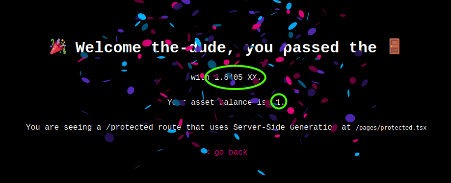

- [What is it](#what-is-it)
- [Requirements](#requirements)
- [What does it do](#what-does-it-do)
- [How to run](#how-to-run)
- [Use cases](#use-cases)
- [What was modified](#what-was-modified)
- [Issues, limitations, workarounds](#issues-limitations-workarounds)
  - [Address format](#address-format)
  - [Asset-gating](#asset-gating)
- [Credits](#credits)

## What is it

This code demonstrates "token-gating" and "asset-gating" on xx Network (and possibly other compatible Substrate-based chains):

- "token-gating" is really "currency-gating" for the native currency of xx chain, XX (coin)
- "asset-gating" is really "token-gating" with xx chain-based assets (which should probably be called tokens, but they aren't since that's taken)

It works with static (server-rendered) and dynamic Web pages.

## Requirements

- Client-side: Polkadot{.js} Web3 wallet; other Web3 wallets may work
- Server-side: NodeJS with access to local or public xx chain RPC endpoint (ws[s]://)

## What does it do

It can limit access to site or sections of site based on ownership or balance of:

- XX coins, for example more than 0, or more than 100
- assets on xx chain, for example more than 1 QTY of asset ID 5
- combination of criteria

Screenshot of xx token-gating: 


You may find more on asset-gating on xx chain [here](https://armchairancap.github.io/blog/2023/11/05/xx-network-asset-gated-access).

With token-gated code added more recently (QTY 1 of asset ID 5 - see further below for more on this):



## How to run

Install Polkadot{.js} extension, create xx Network wallet, fund it with some amount of xx coins (1.01, for example) and set it to work on `xx Network`.


Download this repo, create `.env.local` in root directory, and run:

```sh
cp .env.local.example .env.local
vim .env.local
npm run dev
```

My .env.local for non-production use:

```raw
NEXTAUTH_SECRET=123123123
NEXTAUTH_URL=http://localhost:3000
RPC_ENDPOINT=ws://192.168.1.30:63007
```

Go to http://localhost:3000 in the browser in which you installed Polkadot{.js} and connect the extension to http://localhost:3000, generate an address and make it restricted for use on xx Network (I hoped this would ensure balance will be looked up correctly, but it was not).

With that, I can login (see [xx_screenshot.png](./xx_screenshot.png) and balance of xx coins is correctly shown (since v1.1)). 

(Note that, if you go to https://wallet.xx.network, Polkadot{.js} lets you add the wallet from the browser extension and show it in xx Network Wallet. Neat!)

`npm run build` builds okay, but has a fake warning about multiple versions of some package.

## Use cases

Obviously, token-gating Web sites. But, in the context of xx Network, what kinds?

- Generic infrastructure services for validators - many of whom are too cheap to pay for anything, and too lazy or privacy-conscious to register
- Access to xx Network-related services such as Haven Space directory

Because token-gating only works for *checking* the free balance, site owner can't "deduct" any money from user's wallet. 

That may seem useless - at least with "NFT token-gating" they could have something to sell (NFT for site/service access), but what I think people sometimes miss is the fact that:

- site owner can get paid "out of band"
- site owner can check if the address has transferred xx coin to the site this month 
- site owner can pre-populate form fields with wallet/address used to log in, and provide service to addresses that have already paid

So this integration is not entirely useless even for sites that can't sell xx coin to their members.

## What was modified

`.env.local` and `pages/api/auth/[...nextauth].js` line 92 there's a fall back to public RPC endpoint, but I modified that one to local as well. Asset-gating was also added in that file. In the code we check the balance of asset ID 5 (which on xx Network happens to be `JUNK`) and warn if it's less than 2. I have 1 on mine, which triggers a warning like so.

```raw
ksmAddress:  6aCE19CakDJBp8wnVHB2HpHYfaeNiwx2RxQcsAcyWvPLVn5k
Wallet address on xx Network:  6aCE19CakDJBp8wnVHB2HpHYfaeNiwx2RxQcsAcyWvPLVn5k
Wallet balance on xx Network:  1840527453
Account balance for asset 5 and address 6aCE19CakDJBp8wnVHB2HpHYfaeNiwx2RxQcsAcyWvPLVn5k: 1
Warning: Account balance for asset 5 is less than 2.
token {
  name: 'the-dude',
  sub: '5GxeeFALkRvjnNgkiMjiP6q2GGnZ1ZmFyjCusHG4VoezqZSN',
  freeBalance: '0x0000000000000000000000006db4385d',
  iat: 1730995852,
  exp: 1733587852,
  jti: 'c7a8e87a-0bff-46da-a5be-ffc51726d6dc'
}
```

Currently, in the same file, we check for > 1 XX or more than 1 JUNK, but you can modify as you see fit:

`(accountInfo.data.free.gt(new BN(1_000_000_000)) || assetBalance >= 1)`

In `components/login.tsx` I added some functions for debugging, and logging to console, as you can see above.

In `pages/protected-api.tsx` and `pages/protected.tsx` ("static" protected page), changed KSM to XX and changed the number of decimals to 9 from 12:
```sh
const ksmBalance = formatBalance( session.freeBalance, { decimals: 9, withSi: true, withUnit: 'XX' } )
```

To see everything that's different compared to yk909's fork, see git log.

## Issues, limitations, workarounds

### Address format

Internally, the xx wallet address is shown in generic Polkadot format, which is fine - the same private key could be used with a number of Substrate chain addresses.

```raw
token {
  name: '123123123',
  sub: '5GxeeFALkRvjnNgkiMjiP6q2GGnZ1ZmFyjCusHG4VoezqZSN',
  freeBalance: '0x000000000000000000000000b14a8cbc',
  iat: 1729956938,
  exp: 1732548938,
  jti: '3252212b-0fb2-4a82-88d0-3ceaf5886aa1'
}
```

The FAQs say [it's normal to see another address](https://polkadot.js.org/docs/keyring/FAQ#my-pair-address-does-not-match-with-my-chain).

You can configure the wallet to default to xx Network, by the way (see the screenshot), to avoid that.

### Asset-gating 

This may be xx Network-specific and may not work with other Substrate-based chains. You need to check if your chain supports Assets, and how. It seems Polkadot removed their Assets pallet, for example.

## Credits

Thank you to [the original author](https://polkadot.study/tutorials/tokengated-polkadot-next-js/intro) and the guy who [forked it](https://github.com/yk909/polkadot-js-tokengated-website/) to apply some fixes (verify/compare if you plan to use in production, of course). (See [KSM_README.md](./KSM_README.md) for the upstream README document.)

I hope this sample code can help you save time integrating xx Network or other Substrate projects/chains.

